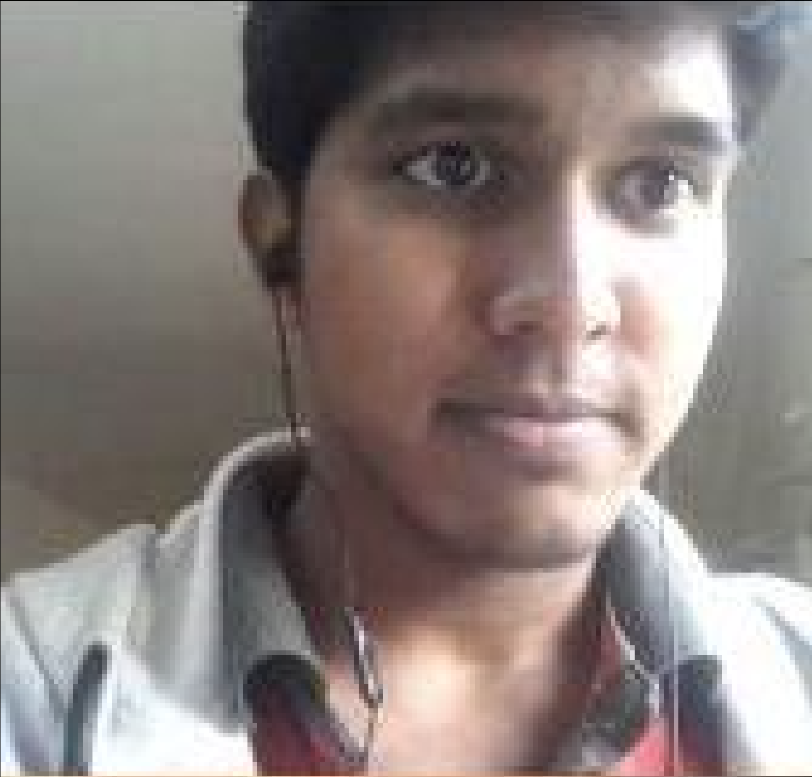
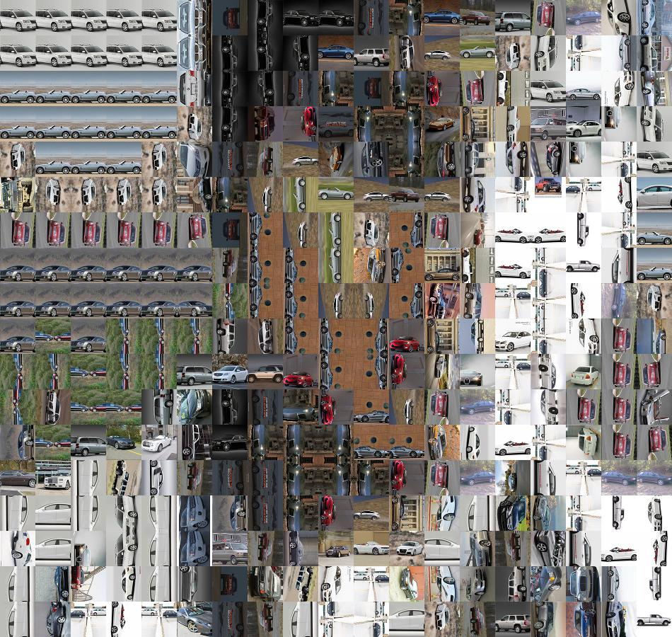

# Mosaicing
create beautiful mosaic arts from any set of images

Click on my blog post : https://kalyan0510.github.io/posts/mosaicing.html
to know about the algorithm in detail

## Few results produced by code:

- Recursive image mosaic  
  

- Mosaic  

  
   

- Distribution of all my google drive images(tile images) based on their mean(avg) color  
  

  
   

https://kalyan0510.github.io/posts/mosaicing.html
